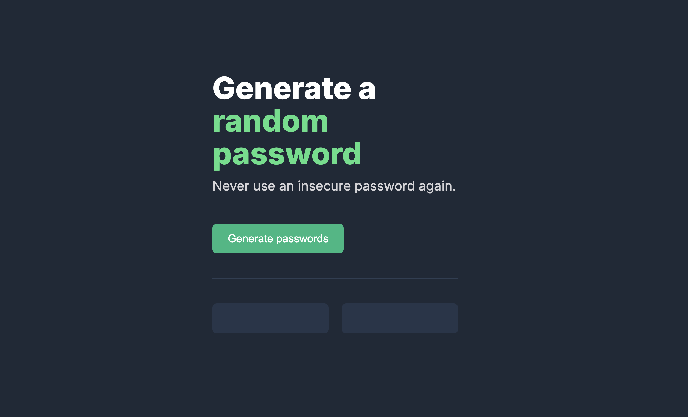

# 🔐 Random Password Generator

A modern and responsive Random Password Generator built using **HTML**, **CSS**, and **JavaScript**. Generate strong, secure passwords instantly with a single click.

## 🚀 Live Demo

https://password-generator-rho-sand-85.vercel.app/

---

## 📸 Preview




---

## ✨ Features

- 🔑 Generate two random passwords
- 🎲 15-character secure passwords
- 📋 Copy password to clipboard
- 🌙 Modern dark theme
- 💻 Fully responsive design
- ⚡ Fast and lightweight
- 🎨 Clean and minimal UI

---

## 🛠️ Built With

- HTML5
- CSS3
- JavaScript (ES6)

---

## 📂 Project Structure

```
Password-Generator/
│
├── index.html
├── index.css
├── index.js
├── README.md
└── preview.png
```

---

## 🚀 Getting Started

### Clone the repository

```bash
git clone https://github.com/BinaryBlaze16/Password-Generator.git
```

### Navigate to the project

```bash
cd Password-Generator
```

### Open in your browser

Simply open `index.html`

or use VS Code Live Server.


---

## 📚 What I Learned

- DOM Manipulation
- Event Listeners
- Arrays in JavaScript
- Random Number Generation
- Clipboard API
- Responsive Design
- CSS Flexbox

---

## 🎯 Future Improvements

- Password length slider
- Password strength indicator
- Uppercase toggle
- Lowercase toggle
- Numbers toggle
- Symbols toggle
- Light/Dark mode
- Copy notification toast

---

## 🤝 Contributing

Contributions, issues, and feature requests are welcome.

Feel free to fork this repository and submit a pull request.

---

## 👨‍💻 Author

**Anant Srivastava**

GitHub:
https://github.com/BinaryBlaze16

---

## ⭐ Show your support

If you like this project, please give it a ⭐ on GitHub.

It really helps and motivates me to build more projects.

---

## 📄 License

This project is licensed under the MIT License.